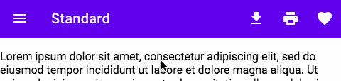

# `<ft-nav>`

> IMPORTANT: The Web Components are a work in progress and subject to
> major changes until 1.0 release.

Nav Bar is a container for items such as application title, navigation icon, and action items.



For a fixed position version of this component, see [`<ft-nav-fixed>`](https://github.com/material-components/material-web/tree/master/packages/top-app-bar-fixed)

[Design Guidelines: App Bars: Top](https://material.io/design/components/app-bars-top.html)

[Demo](https://ruhil-ui.web.app/?path=/story/ruhil-ui-component-navigation--navigation)

<!-- ## Installation

```sh
npm install @material/ft-nav
```

> NOTE: The Material Web Components are distributed as ES2017 JavaScript
> Modules, and use the Custom Elements API. They are compatible with all modern
> browsers including Chrome, Firefox, Safari, Edge, and IE11, but an additional
> tooling step is required to resolve _bare module specifiers_, as well as
> transpilation and polyfills for IE11. See
> [here](https://github.com/material-components/material-components-web-components#quick-start)
> for detailed instructions.
 -->

## Example Usage

### Standard


```html
<ft-nav>
  <ft-icon-button icon="menu" slot="navigationIcon"></ft-icon-button>
  <div slot="title">Title</div>
  <ft-icon-button icon="file_download" slot="actionItems"></ft-icon-button>
  <ft-icon-button icon="print" slot="actionItems"></ft-icon-button>
  <ft-icon-button icon="favorite" slot="actionItems"></ft-icon-button>
  <div><!-- content --></div>
</ft-nav>
```

### Center Title


```html
<ft-nav centerTitle>
  <ft-icon-button icon="menu" slot="navigationIcon"></ft-icon-button>
  <div slot="title">Title</div>
  <ft-icon-button icon="favorite" slot="actionItems"></ft-icon-button>
  <div><!-- content --></div>
</ft-nav>
```

### Dense


```html
<ft-nav dense>
  <ft-icon-button icon="menu" slot="navigationIcon"></ft-icon-button>
  <div slot="title">Title</div>
  <ft-icon-button icon="file_download" slot="actionItems"></ft-icon-button>
  <ft-icon-button icon="print" slot="actionItems"></ft-icon-button>
  <ft-icon-button icon="favorite" slot="actionItems"></ft-icon-button>
  <div><!-- content --></div>
</ft-nav>
```

### Prominent


```html
<ft-nav prominent>
  <ft-icon-button icon="menu" slot="navigationIcon"></ft-icon-button>
  <div slot="title">Title</div>
  <ft-icon-button icon="file_download" slot="actionItems"></ft-icon-button>
  <ft-icon-button icon="print" slot="actionItems"></ft-icon-button>
  <ft-icon-button icon="favorite" slot="actionItems"></ft-icon-button>
  <div><!-- content --></div>
</ft-nav>
```

### Prominent and Dense


```html
<ft-nav prominent dense>
  <ft-icon-button icon="menu" slot="navigationIcon"></ft-icon-button>
  <div slot="title">Title</div>
  <ft-icon-button icon="file_download" slot="actionItems"></ft-icon-button>
  <ft-icon-button icon="print" slot="actionItems"></ft-icon-button>
  <ft-icon-button icon="favorite" slot="actionItems"></ft-icon-button>
  <div><!-- content --></div>
</ft-nav>
```

### Customize Colors


```css
ft-nav {
  --mdc-theme-primary: orange;
  --mdc-theme-on-primary: black;
}
```

## API

### Slots

| Name             | Description                                                                                                                                                                                                                                                     |
| ---------------- | --------------------------------------------------------------------------------------------------------------------------------------------------------------------------------------------------------------------------------------------------------------- |
| `actionItems`    | A number of `<ft-icon-button>` elements to use for action icons on the right side. _NOTE:_ If using with `ft-drawer`, please read note under [`Standard` drawer example](https://github.com/material-components/material-web/tree/master/packages/top-app-bar). |
| `navigationIcon` | One `<ft-icon-button>` element to use for the left icon.                                                                                                                                                                                                        |
| `title`          | A `<div>` or `<span>` that will be used as the title text.                                                                                                                                                                                                      |
| _default_        | Scrollable content to display under the bar. This may be the entire application.                                                                                                                                                                                |

### Properties/Attributes

| Name           | Type                      | Default  | Description                                                                      |
| -------------- | ------------------------- | -------- | -------------------------------------------------------------------------------- |
| `centerTitle`  | `boolean`                 | `false`  | Centers the title horizontally. Only meant to be used with 0 or 1 `actionItems`. |
| `dense`        | `boolean`                 | `false`  | Makes the bar a little smaller for higher density applications.                  |
| `prominent`    | `boolean`                 | `false`  | Makes the bar much taller, can be combined with `dense`.                         |
| `scrollTarget` | `HTMLElement` \| `Window` | `window` | Element used to listen for `scroll` events.                                      |
